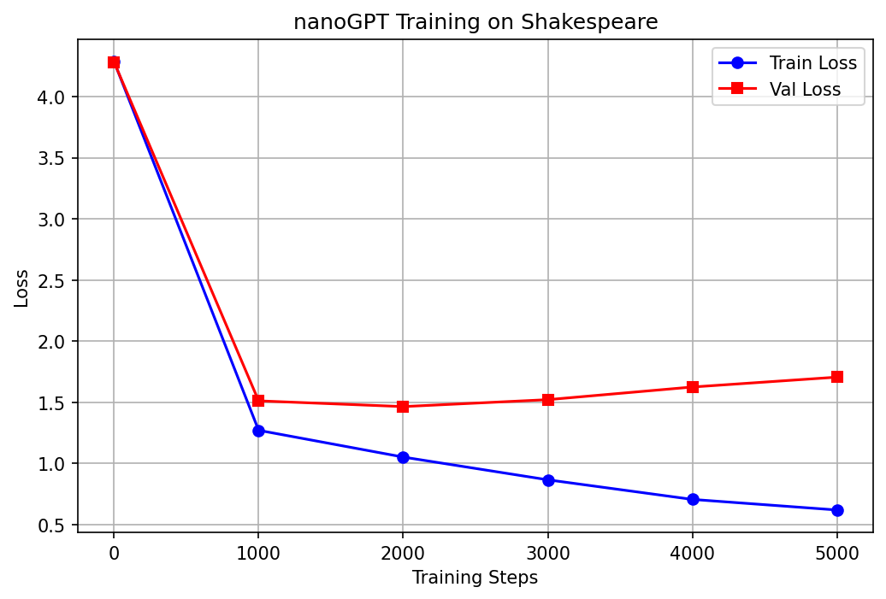

# nanoGPT 学习实验

> 基于 Andrej Karpathy 的 [nanoGPT](https://github.com/karpathy/nanoGPT) 进行学习和实验，目标是理解 Transformer/GPT 的核心原理，并为申请曾哲妮老师课题组做准备。

> 这是本人第一次尝试使用README文档，因此格式并不太熟悉，寻求AI帮助
## 1. 项目目标
- 跑通 Shakespeare 字符级语言模型训练流程
- 理解 GPT 的代码结构和训练机制
- 通过修改超参数观察对模型效果的影响

## 2. 环境配置
- Python 3.10 + PyTorch 2.8.0+cu128
- 依赖：见 README.md
- 硬件：GPU 训练

## 3. 基线实验
**参数配置**：
- `n_layer=6`, `n_head=6`, `n_embd=384`
- `max_iters=3000`, `learning_rate=1e-3`

**实验结果**：
| Step | Train Loss | Val Loss |
|------|------------|----------|
| 0    | 4.2876     | 4.2826   |
| 1000 | 1.2700     | 1.5110   |
| 2000 | 1.0512     | 1.4641   |
| 3000 | 0.8651     | 1.5208   |
| 4000 | 0.7048     | 1.6242   |
| 5000 | 0.6183     | 1.7050   |

**Loss 曲线**：

**生成的文本样例**：
> KING RICHARD III:
> The law better set upon the crown,
> Which time he was the pure of the free land,
> But when I defy the morning to the town,
> If in this nothing executed be content;
> For the true devil deep is even spellling to him;
> And come hither that speak you love us to do't,
> And whom I should that move not what I intent.

## 4. 过拟合观察与分析
随着训练步数增加后，直至5000步，train loss 降至约0.6、val loss 稳定在 1.7左右，判断出现明显过拟合。原因分析：
- 莎士比亚数据集较小（~1M 字符），模型容量相对过大（10.65M 参数）
- 模型开始记忆训练数据而非学习语言规律

**改进尝试**：
| 实验 | 修改 | Val Loss | 效果 |
|------|------|----------|------|
| 基线 | dropout=0.2 | 1.7050 | - |
| 实验 A | dropout=0.5 | 1.5557 | ↓ 约 8% |
| 实验 B | n_layer=4 | 1.5196 | 过拟合减轻但表达能力下降 |
- 实验 B **生成的文本样例**：
> KING RICHARD II:
> Sweet London, and that exceeds the day
> Be ta'en such a parliamage to bed ours.
> 
> NORFOLK:
> What, noble lord?
> 
> KING RICHARD III:
> He may not stay from the neck.
> 
> DUCHESS OF YORK:
> Be it too: it is boundly in a war.

## 5. 核心收获
- **理解了 Loss 的作用**：它是衡量模型预测与真实值差距的指标，训练目标是不断降低 Loss
- **观察到了过拟合现象**：train loss 持续下降但 val loss 不再下降，说明模型开始“背”数据而不是“学”规律
- **初步理解了 GPT 的代码结构**：`model.py` 中的 `CausalSelfAttention` 实现了 Q/K/V 计算，`Block` 类堆叠形成深度网络
- **知道了如何做简单的超参数调优**：改 `n_layer` 和 `dropout` 并用 val loss 评估效果

## 6. 后续计划
- 进一步学习nanoGPT的各部分

## 参考资源
- [nanoGPT 原仓库](https://github.com/karpathy/nanoGPT)
- [The Illustrated GPT-2](https://jalammar.github.io/illustrated-gpt2/)
